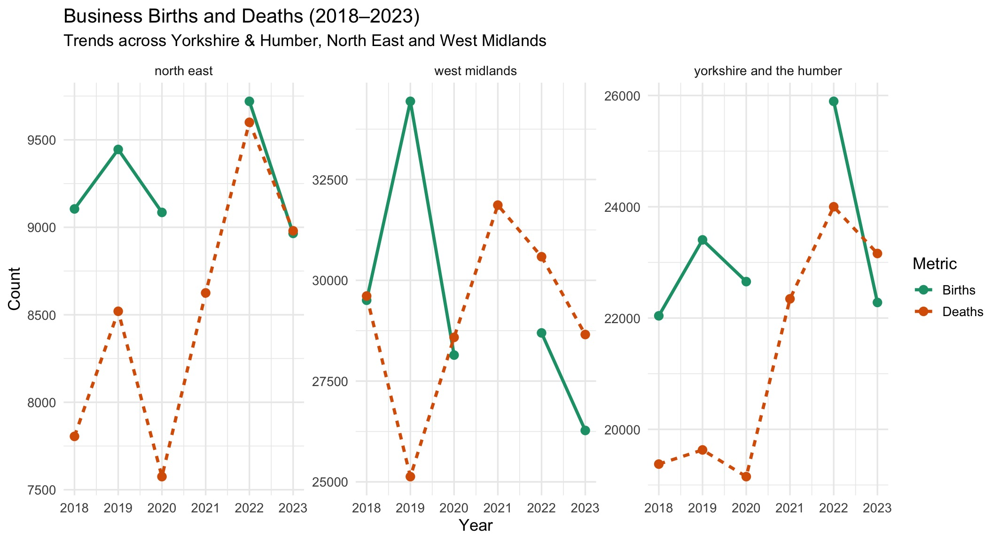
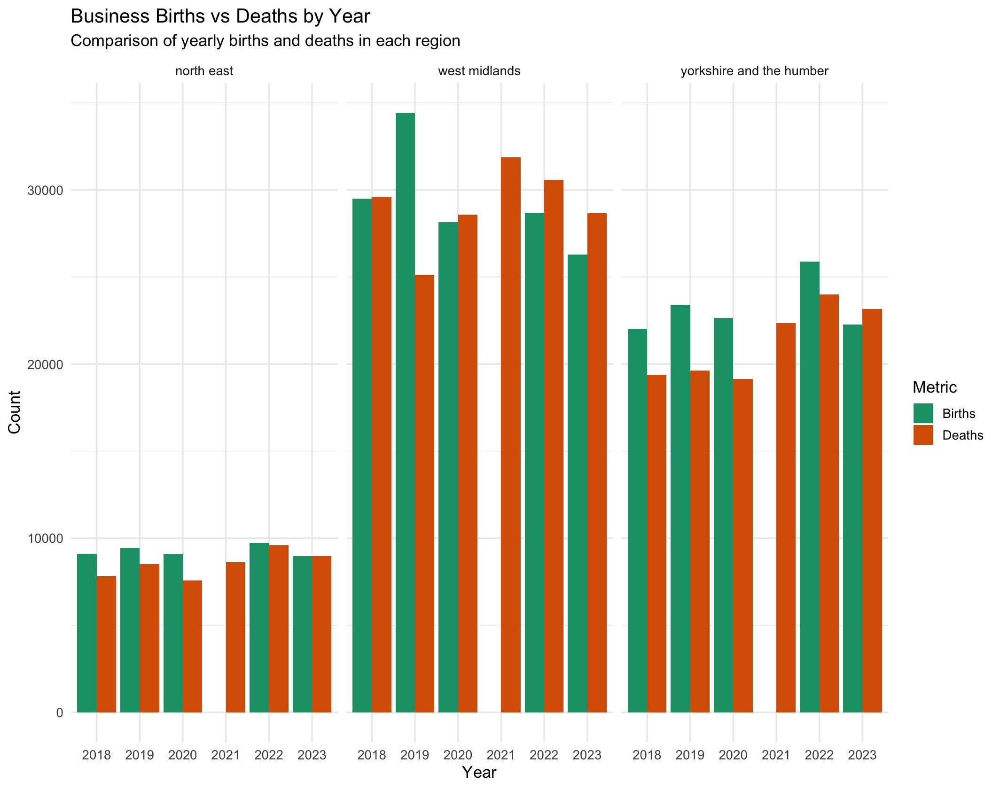
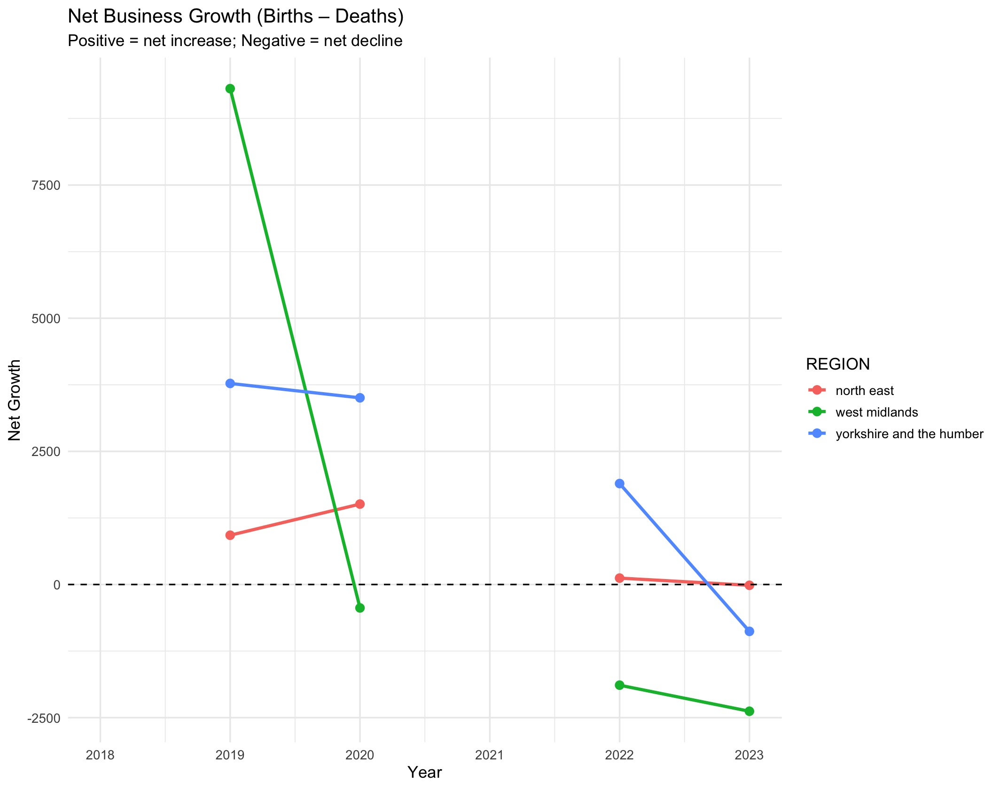
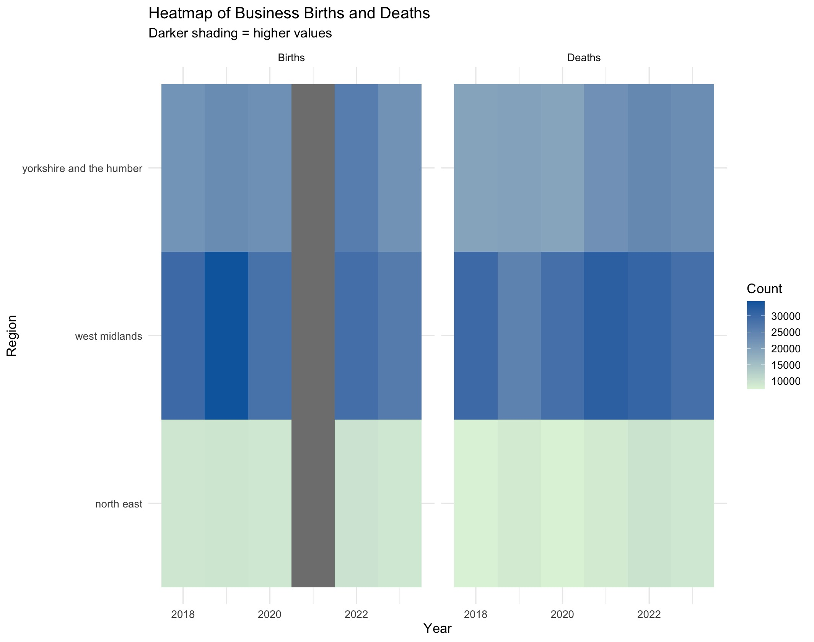

# IJC445 Data Visualisation – Business Births & Deaths (2018–2023)

This project asks: **How have business births and deaths changed over time across Yorkshire & Humber, the North East, and the West Midlands, and how do these patterns differ between regions?**  
Key messages: trends differ across regions; the West Midlands shows the greatest volatility, Yorkshire is comparatively moderate, and the North East remains consistently lower activity.  
All figures were produced in **R (ggplot2)** using ONS Business Demography data.

## Visualisations

### Figure 1: Business births and deaths over time

### Figure 2: Business births vs deaths by year

### Figure 3: Net business growth

### Figure 4: Heatmap of business births and deaths

## Repo contents
- `code/ijc445_visualisations.R` – end-to-end script to load data and generate plots
- `figures/` – exported figures used in the report
